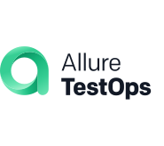

# 👋 Привет! Я — **Рязанов Никита**

### Senior QA Engineer | Backend‑Testing Specialist | Automation Trainee (Java)

---

## О себе

| 🎯 Что делаю                                                       | 📅 Сколько |
|--------------------------------------------------------------------|------------|
| **Тестирование бэкенда онлайн‑кинотеатра**                         | 2 года     |
| **Занимаюсь тестированием**                                        | 4 года     |
| **Ведущий тестировщик** в компании **Триколор**                    | 2 года     |
| **Автоматизация тестирования на Java** – завершаю курс **QA.GURU** | 4 месяца   |

Люблю находить баги там, где их меньше всего ожидают, и превращать рутинные проверки в надёжные, поддерживаемые
автотесты. Сейчас активно осваиваю **Selenide**, **REST‑Assured**, **JUnit 5**, **Allure**, **Gradle** и другие
инструменты полного цикла тестирования.

---

## 📚 Дипломный проект (QA.GURU)

> **Данный профиль заполняю в рамках дипломного проекта на курсе QA.GURU**

### Дипломные работы

| Тип              | Репозиторий                                                      |
|------------------|------------------------------------------------------------------|
| **UI‑тесты**     | <https://github.com/nryazanov13/my_project_12/tree/testops >     |
| **API‑тесты**    | <https://github.com/nryazanov13/my_project_16_api_ui>            |
| **Mobile‑тесты** | <https://github.com/nryazanov13/my_project_18_mob/tree/emulator> |

В каждом репозитории использованы лучшие практики: Page‑Object Model, Clean Architecture, CI/CD (Jenkins) и
подробные отчёты Allure.

---

## 🧰 Технологический стек

  
  
  
  
  
  
  
  

---

## 🛠 Техническая экспертиза

- **Автоматизация:** Java + JUnit + Rest‑Assured + Selenide + Appium + Allure, построение масштабируемой тестовой инфраструктуры,
  интеграция в CI/CD (Jenkins).
- **Тест‑стратегия:** определяю оптимальное соотношение API‑ и UI‑тестов, формирую Definition of Done и критерии приёмки
  фич.
- **Приёмка фич:** участвую в grooming‑сеансах, пишу тест‑кейсы/тест‑планы, провожу smoke‑ и регрессионные запуски,
  контролирую покрытие.
- **Mentoring:** наставляю junior‑а, делегирую задачи, делаю тест-кейс review, делюсь best‑practice.
- **Отчётность:** формирую Allure‑отчёты, поддерживаю метрики качества (coverage, defect‑leakage), участвую в
  ретроспективах.
- **Взаимодействие с dev‑командой:** уточняю требования, совместно ищу корневые причины дефектов, ускоряю процесс
  закрытия багов.
- **Непрерывное улучшение:** исследую новые инструменты, оптимизирую тест‑данные, автоматизирую развёртывание тестовых
  сред.

---

## 🎯 Что я ищу

- Интересные проекты, где можно применить и расширить навыки автоматизации и API‑тестирования.
- Возможность работать в кросс‑функциональной команде, где ценятся качество продукта и быстрый фидбэк.
- Дальнейшее развитие в сторону архитектурного проектирования тестовых фреймворков и повышения эффективности процессов
  QA.

---

## 📞 Как со мной связаться

| Канал        | Ссылка                                        |
|--------------|-----------------------------------------------|
| **Telegram** | <https://t.me/n_ryazanov>                     |
| **Email**    | <riazanovnikita@gmail.com>                    |
| **LinkedIn** | <https://www.linkedin.com/in/nikita-ryazanov> |
| **GitHub**   | <https://github.com/nryazanov13>              |

---

## 🏆 Достижения

- **Изучил автотестирование для сокращения регрисионного цикла на 30 %** за счёт внедрения автоматизированных API‑тестов на Java +
  Rest‑Assured + Selenide.
- **Повысил обнаруживаемость дефектов на 25 %** благодаря введению метрик покрытия и регулярному ревью тестовой
  стратегии.
- **Наставил Junior QA**, который уже самостоятельно покрывает новые фичи автотестами и принимает участие в планировании
  спринтов.

---

## 📌 Итоги

- **Senior QA Engineer**— моя текущая позиция, отражающая высокий технический уровень, активную работу над
  автоматизацией и менторинг junior‑а.
- **Тестирование и приёмка фич** остаются в центре моей профессиональной деятельности, а руководящие функции
  ограничиваются наставничеством и техническим руководством небольшого подчинённого.

Если вам нужен опытный специалист, который умеет не только находить баги, но и строить эффективные процессы
тестирования, давайте обсудим, как я могу помочь вашему продукту стать лучше! 🚀
